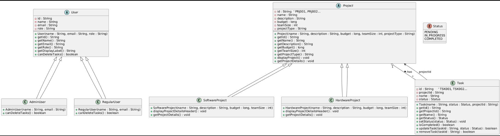
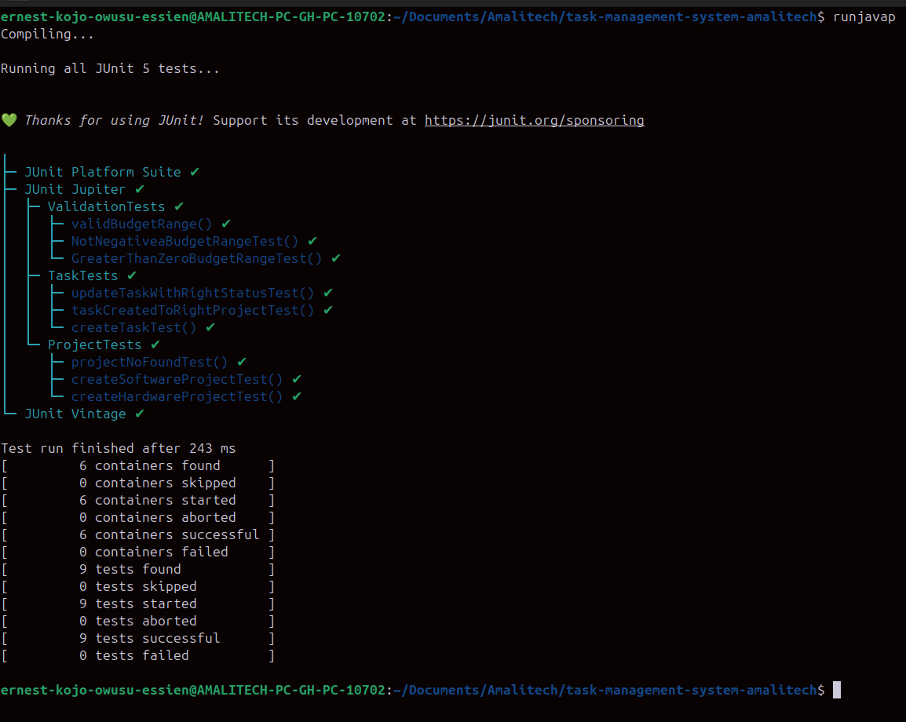
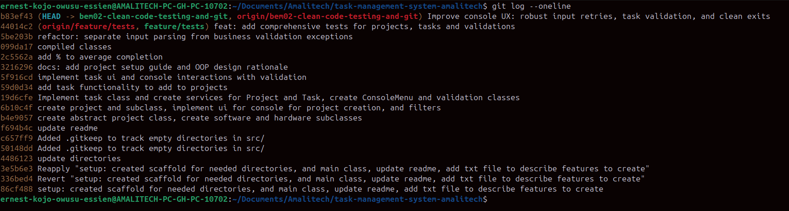

## Java Project Management / Task Management System

This is a console-based Java application that lets you create projects, manage tasks, calculate progress, and experiment with core OOP concepts (abstraction, inheritance, polymorphism, and encapsulation).
It was built as a gradual improvement project to deepen my understanding of Java and object-oriented design.

### What this module focuses on

- Exception handling with custom, domain-focused exceptions (invalid input, not found, storage full).
- SOLID-minded refactors: clearer responsibilities across services/models, better validation and flow control.
- In-memory data using arrays with **JSON file persistence** (via Gson) for saving and loading projects/tasks.
- Streams, lambdas, and a dedicated `StreamService` plus `TaskFilter` functional interface for reusable queries.
- Concurrency basics with a `ConcurrencyService` that simulates safe concurrent task updates.
- Console UX hardening: input validation loops, role-based actions, graceful exits.
- Preparation for testing: structured JUnit 5 tests for core services, stream utilities, and file I/O.

### Setup

- **Requirements**
  - JDK 21 (or compatible JDK 17+)
  - IntelliJ IDEA (recommended) or any Java-capable IDE

- **Clone and open**
  - Clone this repository.
  - Open the project folder in IntelliJ as a **Java project**.

- **Run the app**
  - Locate the `Main` class in `src/Main.java`.
  - Run the `main` method from your IDE, or from terminal:
    - `cd` into the project root.
    - Compile sources into `bin` (if not already compiled by IDE).
    - Run: `java -cp bin Main`

### How to Use

When you start the application, you will see:

- A header showing the **current user** (Admin or Regular).
- The **Main Menu** with options to:
  - Manage Projects
  - Manage Tasks
  - View Status Reports
  - Exit Application

#### User Roles

User roles are created programmatically in `Main`:

- `AdminUser` – can view and manage everything **including deleting tasks**.
- `RegularUser` – can create and update tasks, but **cannot delete tasks**.

In `Main`, both users are registered with `AuthService`. Use the **Main Menu → Switch User** option to change the active user at runtime. The active user is stored via `AuthService` and used for permission checks.

#### Projects

- Projects are created from the **Projects menu**.
- Two concrete project types:
  - `SoftwareProject`
  - `HardwareProject`
- Projects are stored in a fixed-size array (`Project[]`) inside `ProjectService`.
- Each project gets an **auto-generated sequential ID** like `PRJ001`, `PRJ002`, etc.

You can:

- Add a new project (name, description, budget, team size, type).
- View all projects and select one to see detailed information.
- Filter by type (Software/Hardware) or by budget range.

#### Tasks

- Tasks are always associated with a specific project (via project ID).
- Tasks are stored in a fixed-size array (`Task[]`) inside `TaskService`.
- Each task gets an **auto-generated sequential ID** like `TSK001`, `TSK002`, etc.

From the **Tasks menu** you can:

- Add a task to a project.
- View all tasks for a chosen project.
- Update a task’s status (Pending / In Progress / Completed).
- Delete a task **(Admin only)**.

Completion percentage per project is calculated by `TaskService.completionRate` and displayed when viewing tasks for that project.

#### Status Reports

- The **Status Reports** option generates a report that summarises project progress using task completion data (total tasks, completed tasks, and per-project completion).
- Reports are currently generated in memory and shown in the console using stream-based aggregations.

### Object-Oriented Design

The project demonstrates several OOP principles:

- **Encapsulation**
  - Model classes (`Project`, `Task`, `User`, and subclasses) use private/protected fields with public getters.
  - Services (`ProjectService`, `TaskService`, `ReportService`) expose clear methods instead of exposing arrays directly.

- **Abstraction & Inheritance**
  - `Project` is an abstract base class extended by `SoftwareProject` and `HardwareProject`.
  - `User` is an abstract base class extended by `AdminUser` and `RegularUser`.

- **Polymorphism**
  - `User.canDeleteTasks()` is overridden so `AdminUser` can delete tasks and `RegularUser` cannot.
  - `Project` subclasses override methods that display project details.

- **Interfaces**
  - `Completable` interface is implemented by `Task` to represent “completable” entities.

### ID Auto-generation

- Projects use a static counter in `Project` to generate IDs in the form `PRJ001`, `PRJ002`, … within a single run.
- Tasks use a static counter in `Task` to generate IDs in the form `TSK001`, `TSK002`, … within a single run.
- Users use a static counter in `User` to generate IDs like `USR-1`, `USR-2`, …

IDs are guaranteed unique **within a single session** of the application. Because everything is in memory, restarting the app resets the counters.

### Validation and Error Handling

- Input validation uses `ValidationUtils` to check:
  - Valid project types (`Software`, `Hardware`).
  - Valid budget ranges (min and max constraints).
- Task creation validates project existence and avoids duplicate task names per project.
- Menu handlers check for numeric input, reject invalid IDs via `RegexValidator`, and show user-friendly error messages with seamless re-prompts.

### UML and Design Documentation

- Class diagram:  
  
- Detailed design rationale (abstraction, inheritance, polymorphism, storage choices, and ID strategy): see `docs/design-decisions.md`.

### Test Results

### Commit Log Snapshot

### What you should learn here

- How to structure console apps with clear separation of concerns (models, services, utils).
- How to use custom exceptions to keep validation and error handling explicit.
- How to apply polymorphism for role-based permissions and type-specific behavior.
- How to use streams, lambdas, and functional interfaces (`TaskFilter`) to express queries cleanly.
- How to make user input resilient with re-prompts and graceful shutdowns.
- How to keep code testable and modular with JUnit 5 tests for services, streams, and file utilities.

### Minimum Requirements Coverage (Summary)

- Arrays refactored to collections (`ArrayList`, `HashMap`) in services.
- Functional programming implemented via streams, lambdas, and the `TaskFilter` functional interface.
- Regex validation implemented for IDs using `RegexValidator` (`PRJ###`, `TSK###`).
- File persistence working using Gson (`FileUtils.saveProjects` / `FileUtils.loadProjects`).
- Concurrency demo implemented with threads in `ConcurrencyService.simulateConcurrentTasksUpdates`.
- JUnit 5 tests cover stream logic (`StreamServiceTests`) and file persistence/concurrency behavior (`FileUtilsTests`, service tests).
- Custom exceptions and proper handling used across services (invalid input, not found, storage full).
- Clean, modular, SOLID-leaning code with clear separation between models, services, utils, and tests.
- README and design documentation updated with diagrams, test results, and commit log snapshot.